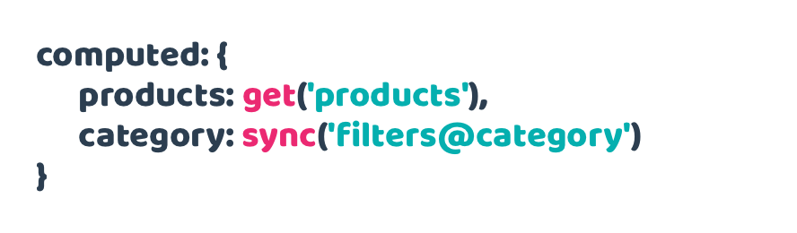
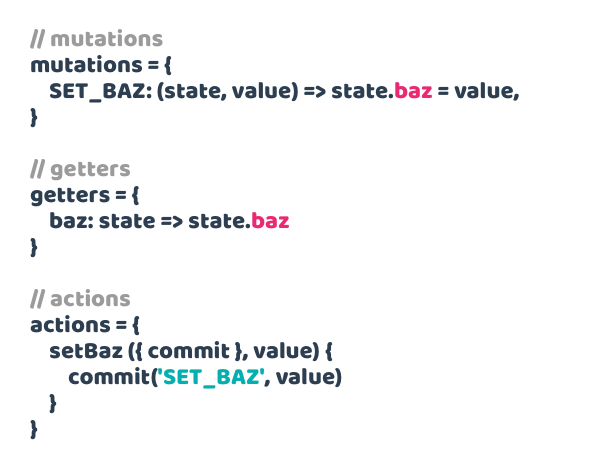
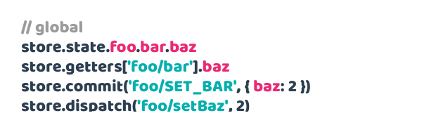
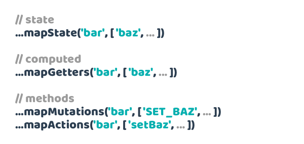
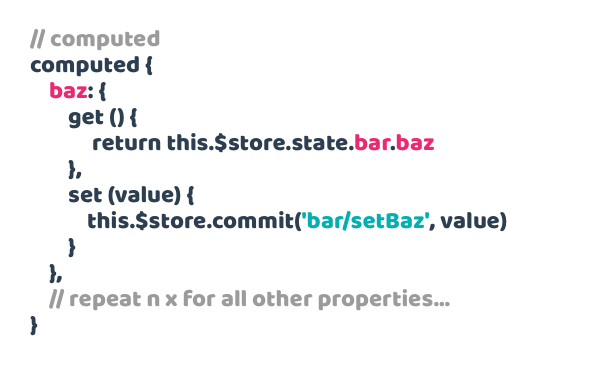

## Overview

Pathify makes working with Vuex **easy**, with a **declarative**, **state-based**, **path syntax**:

Paths can reference any **module**, **property** or **sub-property**:

**Get** or **set** data without **syntax juggling** or worrying about **implementation**:

Set up **one or two-way** data binding on **any** store value without **bloat** or **fuss**:

Wire **multiple** properties or sub-properties using **array**, **object** and **wildcard** formats:

Map **store actions** in exactly the same way, even using **wildcards**:

Set up your store – **no matter how complex** – in a single line:

And... that's it.

## Vuex comparison

Conversely, working with Vuex directly requires is much more work.

Store setup is a manual and laborious process:

 
Getting and setting values requires juggling accessors, syntax and naming:

Component wiring can require up to 4 different helpers, name juggling, plus additional template binding:

Writing computed properties takes this much code **per property** for 2-way wiring:

Essentially, vanilla Vuex takes a lot of manual JavaScript coding to both set up and maintain.

Check out the [code comparison](https://codesandbox.io/s/github/davestewart/vuex-pathify-demos/tree/master/main?initialpath=code) demo which illustrates a reduction in Vuex code when using Pathify, of between **2 and 14 times** (or more) depending on store size and setup.

## Summary

In practical terms, Pathify results in:

- less cognitive overhead
- zero store boilerplate
- one-liner wiring
- cleaner code
- lighter files

### Next steps

Get started:

- [Installation](https://www.npmjs.com/package/vuex-pathify)
- [Documentation](https://davestewart.github.io/vuex-pathify)

Demos:

- [Simple demo](https://codesandbox.io/s/github/davestewart/vuex-pathify-demos/tree/master/simple)
- [Main demo](https://codesandbox.io/s/github/davestewart/vuex-pathify-demos/tree/master/main)
- [Nuxt demo](https://github.com/davestewart/vuex-pathify-demos/tree/master/nuxt)
