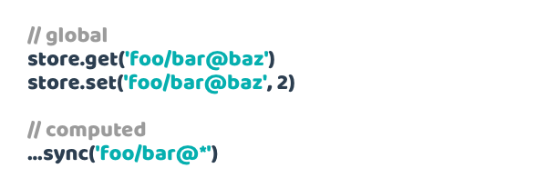

## Overview

Pathify makes working with Vuex **easy**, with a **unified, state-based, path syntax**:

Pathify's core helpers let you easily **read, write** or **sync** any store **property** or **sub-property**:

In conjunction with store helpers, Pathify results in zero store boilerplate, one-liner wiring, less cognitive overhead, and radically cleaner code.

## Pathify API

Let's look a little more closely at the code needed to do this.

Our example store has **module**, **property** and **sub-property** nodes:

The store is made **writeable** using Pathify's one-liner [store helpers]:

Pathify's [store accessors] and handle global **I/O** whilst [component helpers] handle **wiring**:

Using the now familiar [path syntax] sub-properties are accessed using the `@` symbol, whilst multiple properties can be wired using object, array, or even wildcard `*` syntax wiring groups of properties automatically.

## Comparing to Vuex

The start of most Vuex projects require extensive manual, labourious, store setup:

 
Getting and setting values requires juggling accessors, syntax and naming:

Component wiring can require up to 4 different helpers, name juggling, plus additional template binding:

Pathify's demo [compares](https://codesandbox.io/s/github/davestewart/vuex-pathify/tree/master/demo?initialpath=code) what could be considered both typical and large components across a variety of Pathify and Vuex setups, and finds Pathify setups coming in between 2 and 15 times less code than vanilla Vuex.

## Next steps

So if you like what you see, here's where to go next:

- Try the [demo](https://codesandbox.io/s/github/davestewart/vuex-pathify/tree/master/demo)
- Check out the [documentation](https://davestewart.github.io/vuex-pathify/)
- Install the [package](https://www.npmjs.com/package/vuex-pathify)

[path syntax]: https://davestewart.github.io/vuex-pathify/#/api/paths
[component helpers]: https://davestewart.github.io/vuex-pathify/#/api/component
[store helpers]: https://davestewart.github.io/vuex-pathify/#/api/store
[store accessors]: https://davestewart.github.io/vuex-pathify/#/api/accessors

