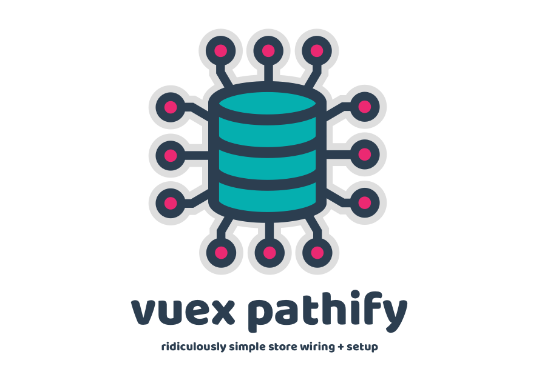
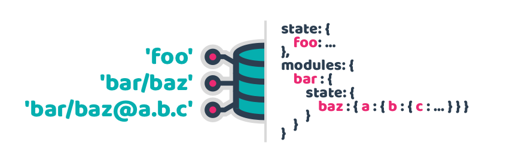

## Overview

Pathify makes working with Vuex **easy**, with a **declarative**, **state-based**, **path syntax**:


Paths can reference any **module**, **property** or **sub-property**:



Pathify's aim is to simplify the overall Vuex development experience by abstracting away Vuex's complex setup and reliance on manually-written code. The path syntax does the heavy-lifting, with a small set of helper functions used to directly access or wire up components to the store.

## Examples

**Get** or **set** data without **syntax juggling** or worrying about **implementation**:

```js
store.get('loaded')
store.set('loaded', true)
```

Reach into **sub-properties** and **arrays**:

```js
store.get('products@items.0.name')
store.set('products@items.1.name', 'Vuex Pathify')
```

Set up **one or two-way** data binding on **any** store value without **bloat** or **fuss**:

```js
computed: {
  products: get('products'),
  category: sync('filters@category')
}
```

Wire **multiple** properties (or sub-properties) using **array**, **object** and **wildcard** formats:

```js
computed: {
  ...sync('filters@sort', [
    'order', 
    'key'
  ]),

  ...sync('filters@sort', {
    sortOrder: 'order',
    sortKey: 'key'
  }),

  ...sync('filters@sort.*')
}
```

Use **variable expansion** to dynamically reference store properties:

```js
computed: {
  product: get('products@items:index')
}
```

Set up mutations – **including sub-property mutations** – in a single line:

```js
make.mutations(state)
```

## Results

In practical terms, Pathify results in:

- less cognitive overhead
- zero store boilerplate
- one-liner wiring
- cleaner code
- lighter files

The [code comparison](https://codesandbox.io/s/github/davestewart/vuex-pathify-demos/tree/master/main?initialpath=%23%2Fcode%2Flarge) demo demonstrates reductions in lines of code of between **2 and 14 times** (or more) depending on store size and setup.

To see the principles behind such radical code reduction, check out the [Pathify 101](https://davestewart.github.io/vuex-pathify/#/intro/pathify).

## Next steps

Get started:

- [Installation](https://www.npmjs.com/package/vuex-pathify)
- [Documentation](https://davestewart.github.io/vuex-pathify)

Demos:

- [Simple demo](https://codesandbox.io/s/github/davestewart/vuex-pathify-demos/tree/master/simple)
- [Main demo](https://codesandbox.io/s/github/davestewart/vuex-pathify-demos/tree/master/main)
- [Nuxt demo](https://github.com/davestewart/vuex-pathify-demos/tree/master/nuxt)
