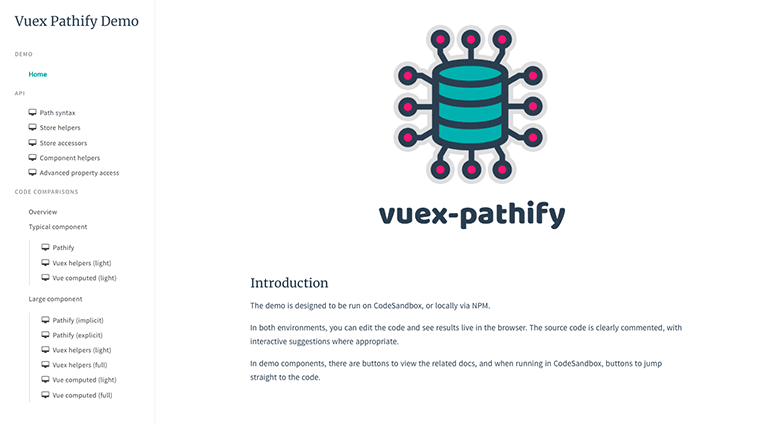

# Demos

> See Pathify in action

Playing with the code is often the quickest way to see how a library works, so Pathify has a bunch of editable demos.

Use the navigation to load the demos, then click the green buttons at the top to edit the associated files:

To run the demos now, click [here](https://codesandbox.io/s/github/davestewart/vuex-pathify/tree/master/demo).

