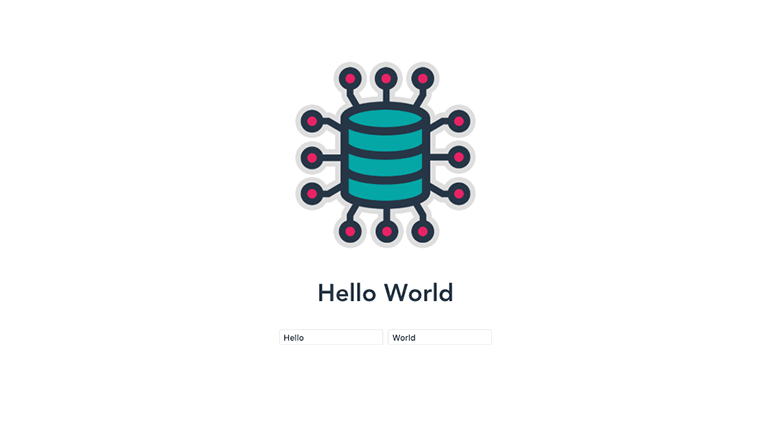
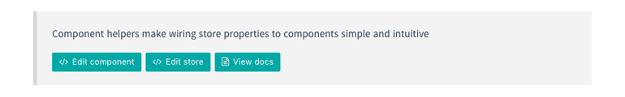

# Demos

> See Pathify in action

Playing with the code is often the quickest way to see how a library works, so Pathify has a bunch of editable demos.

Demos can viewed and edited [online](https://codesandbox.io/s/github/davestewart/vuex-pathify/tree/master/demo) or [downloaded](https://github.com/davestewart/vuex-pathify-demos) and run locally. 

## Simple demo

This demo shows a basic, 2-property store setup with Pathify component wiring.

[][simple]

The demo is completely self-contained and is in effect a Pathify starter template.

To load the simple demo, click [here][simple].

## Main demo

This set of demos contains a range of components + store setups illustrating both API and real-world usage:

[][main]

Use the navigation to load the demos, then click the green buttons at the top to edit the associated files:

To load the main demo, click [here][main].

## Nuxt demo

Finally, there is a [Nuxt](https://nuxtjs.org/) demo, to ensure that Pathify works correctly on the server side.

Rather than being viewable in a browser, the Nuxt demo must be downloaded, installed and run locally.

To view the repository, click [here](https://github.com/davestewart/vuex-pathify-demos/tree/master/nuxt).

[simple]: https://codesandbox.io/s/github/davestewart/vuex-pathify-demos/tree/master/simple?module=%2Fsrc%2Fcomponents%2FHelloWorld.vue
[main]: https://codesandbox.io/s/github/davestewart/vuex-pathify-demos/tree/master/main
